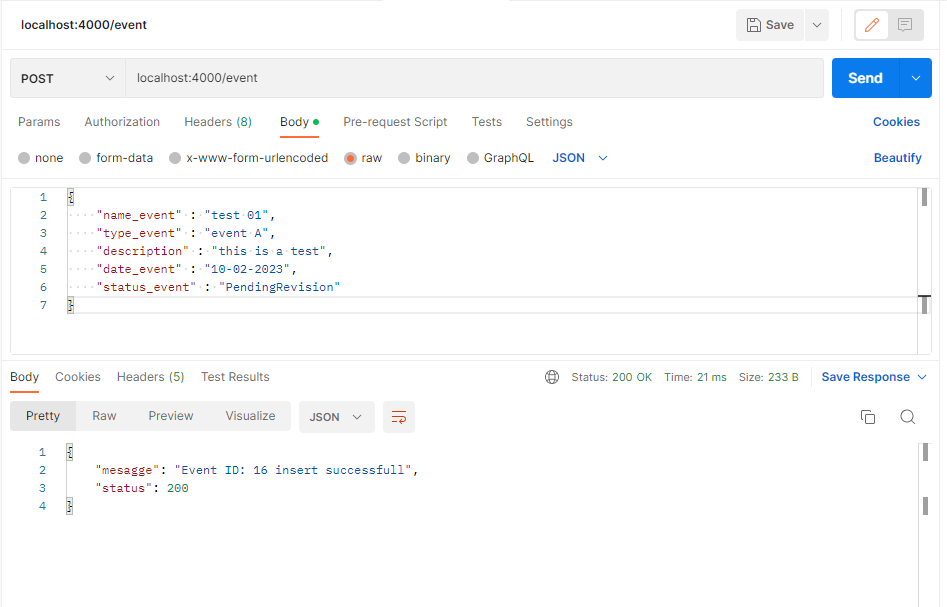

# PruebaTecnicaSIER

# 0 -> Install dependencies:

python3 -m pip install flask

# 1 -> To Excecute:

Run the main file (main.py) and consume via POSTMAN.

# 2 -> About Database

This is in SQLite3 (For easy implemetation) and consume through file (Database.py)

Event(ID,name_event,type_event,description,date_create,date_last_update,status_event,visible)

- ID >> Is a integer to identify a Event.
- name_event >> Is a text to put a name of event
- type_event >> Is a text to diferenciates a type of event PUT GET DELETE PACTH ...
- description >> Is a text to comment a event
- date_create >> Is a timedate of server when the event is create
- date_last_update >> Is a timedate of server when the event is modify.
- status_event >> only two types PendingRevision | Revisated 
- visible >> Integer 1 or 0  to indicates if event is delete or not delete

# 3 -> About the routes

NOT HTTPs only HTTP

## localhost + port + / + endpoint

http://localhost:4000/health

Say if the server is running.

http://localhost:4000/event

Route to ADD, EDIT, DELETE and VIEW the events, you need specifed a verb:

- GET: obtain a events.
- POST: save a event.
- PATCH: edit a event.
- DELETE: Hide a event.

## Add event:

Enter the url localhost:4000/event method POST and send de Json with the information for example:

{
    "id" : 1,
    "name_event" : "event001",
    "type_event" : "test",
    "description" : "This is a test event",
    "date_event" : "08-02-2023",
    "status_event" : "PendingRevision"
}

## Get events

Enter the url localhost:4000/event method GET and send the params to get the information
and return a Json file 

{
 data: vector with rich information,
 status: code of return,
 message: string with,
}

## Params:

### id

is the input value to filter a information for examples:

- id = all : return all events in the database

- id = count : return count of all events

- id = Number : of event return a event with the ID specificated.

